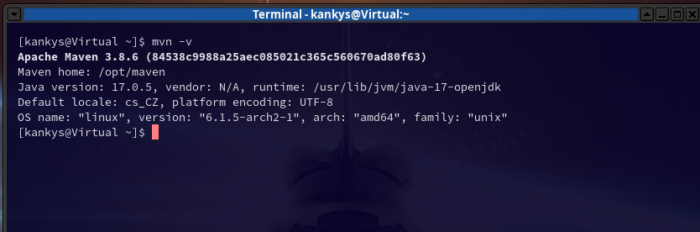
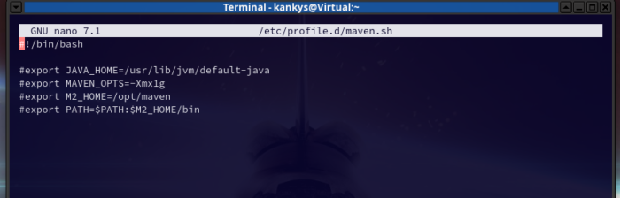
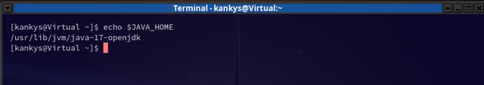

# Jak v Arch Linux nastavit JAVA_HOME a Maven Proměnné

Pokud začínáte programovat v Jave do budoucna se vám bude hodit jak nastavit JAVA_HOME a ušetříte si případně starosti s tím proč vám něco nefunguje.

Návod je psán pro Arch Linux, ale měl by být použitelný i v jiných distribucích ( jen bude některé příkazy nutno přizpůsobit).

Nejprve začneme instalací Maven, tak nám nabídne rovnou instalaci Javy.

V terminálu se přihlásíme pomocí su a zadáme:
```
pacman -S maven
```
Instalátor nabídne ke stažení Javu. Já zvolil java-17-openjdk. Pak potvrdíme vše a nainstalujeme Maven a případně i javu.

Že máme vše nainstalované ověříme příkazem:
```
mvn -v
```



Nastavíme proměnné tím že do konzole zadáme:
```
sudo nano /etc/profile.d/maven.sh
```
Otevře se textový editor v konzoli a tam zadáme toto:
```
export JAVA_HOME=/usr/lib/jvm/default-java
export M2_HOME=/opt/maven
export MAVEN_HOME=/opt/maven
export PATH=${M2_HOME}/bin:${PATH}
```
Pomocí CTRL+O vše zapíšeme a CTRL+X ukončí textový editor.



Zadáme příkaz:
```
$ sudo chmod +x /etc/profile.d/maven.sh
```
a
```
source /etc/profile.d/maven.sh
```
Tím máme nastavené Maven a nastavíme java proměnné.

V terminálu zadáme tento příkaz abychom zjistili jakou máme verzi javy:
```
java –version
```
Číslo verze si poznamenejte a v terminálu zadejte:
```
nano ~/.bashrc
```
Znovu se otevře textový editor a nakonec přidáte tyto dva řádky (verze javy se může lišit):
```
export JAVA_HOME=/usr/lib/jvm/java–17-openjdk

export PATH=$PATH:$JAVA_HOME/bin
```
Vše uložíme a ukončíme nano.

Do terminálu vložíme:
```
 source ~/.bashrc
```
A ověříme že je proměnná nastavena tímto příkazem:
```
echo $JAVA_HOME
```
Pokud je vše dobře uvidíte podobný výstup:



Pokud se vám v kořenovém adresáři nevytvořila složka .m2 a potřebujete ji použijte tento příkaz:
```
mkdir -p ~/.m2
```