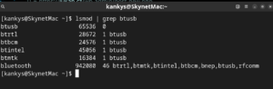

# EndeavourOS jak opravit nefunkční Bluetooth po instalaci na MacBook Pro 2015

Někteří z vás uvažují na starším MacBooku přejít na Linux. Jedna ze skvělých distribucí je [EndeavourOS](https://endeavouros.com/) vycházející z [Arch Linuxu](https://archlinux.org/).

Bohužel se vám může stát, že po instalaci vám nepůjde Bluetooth, ale to se dá naštěstí velmi dobře opravit.

Tuto  distribuci je možné nainstalovat pomocí live image offline což je výhoda, že nefunkční Bluetooth se bude řešit až po instalaci.

Pokud nemáte WiFi připojení v Macbooku,  kabelem připojíme k MacBooku telefon, který  je na WiFi.  Máte li neomezené data nemusíte být na WiFi.

Na telefonu po připojení potvrdíte, že důvěřujete tomuto zařízení a MacBook se připojí k internetu.

V aplikacích najdeme aplikaci Welcome a klikneme na Update Mirrors.

Pak dáme Update System.

Až se systém aktualizuje přejdeme na samotnou instalaci ovladačů.

Zapneme aplikaci Terminal (Console).

1. Do terminálu zadáme:
```
lsmod | grep btusb
```
Pokud vám terminál vypsal něco podobného:



Můžete jít rovnou na krok 4.

Pokud vám nic takového nevypsal nebo chybu nemáte instalované ovladače na Bluetooth.  Pokračujte dále.

2. Nainstalujeme ovladače Bluetooth, do terminálu zadáme:
```
sudo pacman -S bluez
sudo pacman -S bluez-utils
sudo pacman -S blueman
```
3. Znovu ověříme zda jsou už nainstalované:
```
lsmod | grep btusb
```
4. Dále spustíme službu Bluetooth:
```
sudo systemctl start bluetooth.service
```
5. Pokud chcete aby se vám služba spouštěla automaticky tak ji povolíme:
```
sudo systemctl enable bluetooth.service
```
6. Restartujeme MacBook

7. V nastavení systému nebo v nástrojové lište podle toho jaké máte nainstalované prostředí spárujeme vaše Bluetooth zařízení.

 

Návod nezaručuje stoprocentní funkčnost, ale vždy pomohl.

Vše co děláte, děláte na vlastní nebezpečí. V případě problému lukan.cz neručí za vzniklé škody a nelze po něm vymáhat náhradu.

Vždy než něco potvrdíte přečtěte si co vám systém píše nebo log.