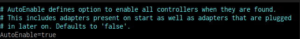

# Jak v EndeavourOS jak zprovoznit Bluetooth?


Tento návod by měl být funkční na Arch Linux a distribucí z něj vycházejících.

## Krok 1: Nainstalujte Bluez a Blueman

Prvním krokem je instalace několika balíčků.

Nainstalujeme si:

* Bluez
* Bluez Utils
* Blueman
```
sudo pacman -S bluez
sudo pacman -S bluez-utils
sudo pacman -S blueman
```
Ty by se měly nainstalovat bez problémů. Zde uvidíte úhlednou ikonu:


Dále se ujistěte, že je načten modul btusb Kernel:
```
lsmod | grep btusb
```


Zde je trik, který mu pomůže najít adaptéry plug one:
```
sudo vim /etc/bluetooth/main.conf
```
Automaticky povolí Bluetooth:



Uložte soubor.

## 2. Aktivujte Službu

Zkusme spustit službu Bluetooth:
```
sudo systemctl start bluetooth.service
```
Automatické spuštění Bluetooth po startu povolíme tímto příkazem:
```
sudo systemctl enable bluetooth.service
```
Nyní bychom měli mít vše v provozu. Pomocí Blueman můžete spravovat Bluetooth zařízení, kliknutím pravým tlačítkem myši na ikonu Bluetooth.

Nyní byste měli být připraveni na připojení a párování.

## 3. Párování

Blueman dělá párování snadné.


1. Vyberete zařízení.
2. Zahájit párování.

A máte hotovo!
