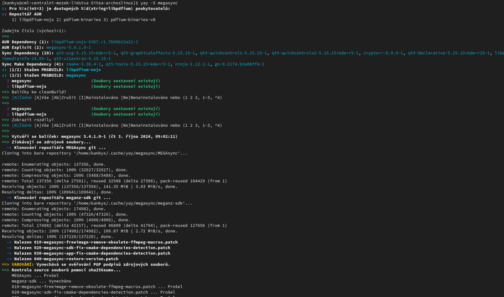

# Jak v i3wm opravit nefunkční nastavení jasu monitoru



Pokud vám po instalaci i3wm nefunguje jas monitoru, náprava je poměrně jednoduchá.

Nainstalujte si brightnessctl pomocí příkazu:
```
yay -S brightnessctl
```
Restartujte počítač a otestujte funkčnost jasu monitoru. Změna se provede tímto příkladem.
```
brightnessctl se 30
```
Pokud se vám jas snížil na 30% je vš v přádku a můžeme pokračovat nastavení ovládání jasu na klávesnici.

### Ovládání jasu pomocí klávesnice:

Ve skriptu ~/.config/i3/scripts/volume_brightness.sh
na konci změnit záznam na:
```
  brightness_up)
    # Increases brightness and displays the notification
    brightnessctl set "10%+"
    show_brightness_notif
    ;;

    brightness_down)
    # Decreases brightness and displays the notification
    brightnessctl set "10%-"
    show_brightness_notif
    ;;
```
A to je vše,teď by Vám nastavení jasu mělo jít pomocí funkčních kláves.
