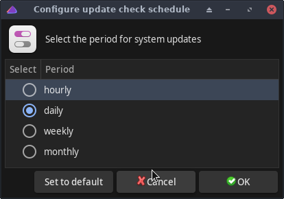

# Jak zapnout upozornění na nové aktualizace

Ne každému se chce hlídat nové aktualizace v terminálu, naštěstí EndeavourOS na to máme nástroje.

Abychom mohli začít využívat upozornění na nové aktualizace, je potřeba si nainstalovat **eos-notifier**. Ten nainstalujeme pomocí tohoto příkazu:
```
            yay -S eos-update-notifier
```          

Notifikace zapneme tímto příkazem:
```
          eos-update-notifier -init
```          

Přesuneme se do nabídky programů a tam vyhledáme aplikaci **Configure EOS Update Notifier**.



V aplikaci si nastavíme pod tlačítkem **Schedule** jak často mají kontroly probíhat, můžeme zaškrtnout například kontrolu aktualizace ihned po startu.

Pod tlačítkem **Edit config** se dostaneme k podrobnějšímu nastavení pro zkušenější uživatele.

Pak zde už najdeme pouze tlačítka k otestování notifikací, reset, status, vypnutí a zapnutí aktualizací. **Pozor aby jste měli zaškrtnuté tlačítko Enable, tím potvrzujete automatické upozornění na aktualizace**.

Jakmile vám přijde notifikace o nových aktualizacích můžete je nainstalovat. Nejednoduší způsob je pomocí aplikace **eos-update**. Spustí se vám terminál, do něj zadáte své heslo a postupujete dle terminálu co vám vypisuje.

**EOS-update** vždy první nabízí aktualizace eos repozitářů a pak všech ostatních.

Tento postup byl testován v prostředí Gnome.