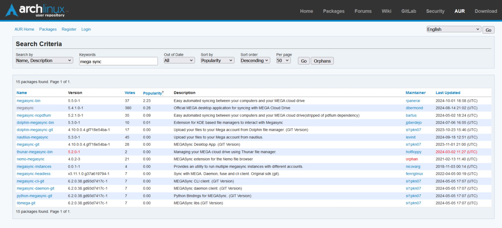

# 🚀 EndeavourOS – AUR packages a jak nainstalovat aplikaci pomocí YAY


[EndeavourOS](https://endeavouros.cz/) jako všechny ostatní distribuce rodiny [Arch Linux](https://arch-linux.cz/) nabízí obří seznam balíčků a aplikací k instalaci. Pokud znáte přesný název balíčku, můžete přejít ihned k instalaci, ale pokud ho neznáte nebo něco hledáte využijeme [AUR packages](https://aur.archlinux.org/).

Aby jste si ověřily dostupnost Vašeho balíčku co hledáte navštivte [AUR packages](https://aur.archlinux.org/). Na stránce Vás bude nejvíce zajímat položka [Packages](https://aur.archlinux.org/packages), zde najdete seznam všech balíčku co si můžete nainstalovat do Vašeho OS. V kolonce **Keywords** můžete balíčky vyhledávat dle názvu.

My jsme si pro tento článek vybrali balíček Megasync. Do vyhledávacího pole jsme zadali slovo Mega sync klikly na GO.

Zobrazil se nám seznam všech výsledků kde se nachází Megasync.



Já si vybral Official MEGA desktop application for syncing with MEGA Cloud Drive. Když balíček rozklikneme, najdeme odkaz na git, jakou má licenci, číslo verze a další.

Pokud balíček budeme chtít nainstalovat přejdeme k instalaci.

1. Zkopíruj si přesný název balíčku.

2. Otevři terminál a vlož do něj yay -S a zkopírovaný text:
```
yay -S megasync
```


3. Budete vyzváni k zadání hesla root, následně si budete moc zkontrolovat název i číslo verze balíčku jestli je to vážně ten co chcete nainstalovat a potvrdíte pomocí ENTER. Pokud bude v nabídce více verzí balíčku nebo více repozitářů ke stažení budete vyzváni vybrat verzi kterou chcete. To provedete pomocí  čísla 1 – xxx, a zase potvrdíte pomocí ENTER.

4. Během instalace budete možná vyzváni ještě jednou zadání hesla root. Možná se Vám zobrazí dotaz jestli je možné v instalaci pokračovat a jestli má systém odstranit nepotřebné balíčky po instalaci. V české verzi dáte **a** jako **ano** a v anglické **y** jako **yes**. Jako zápor v české i anglické verzi je **n** – **ne** a **no**.

Po dokončené instalaci by jste měli vidět už balíček v nabídce aplikací. Pozor pokud instalujete aplikaci/ balíček  pro terminál nemusí se Vám zobrazit v nabídce aplikací, ale spouští se zadáním názvu v terminálu.

 

Pokud chcete vědět více o EndeavourOS nebo se stát členy české komunity EndeavourOS navštivte   [EndeavourOSCZ](https://endeavouros.cz/) a [Fórum Arch Linux CZ](https://forum.arch-linux.cz/).
