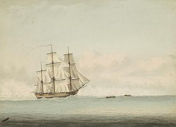

# ⛵ Co znamená logo v EndeavourOS?
Možná vás někdy napadlo co znamená nebo jak vzniklo logo EndeavourOS.

Odpověď najdeme v roce 1768.

Souřadnice: 41°36′N 71°21′W / 41.600°N 71.350°W / 41.600; -71.350 (Narragansett Bay) HMS Endeavour, také známý jako [HM Bark Endeavour](https://en.wikipedia.org/wiki/HMS_Endeavour), byl britským výzkumným plavidlem královského námořnictva, které poručík [James Cook](https://en.wikipedia.org/wiki/James_Cook) přikázal Austrálii a Novému Zélandu při své první plavbě objevů v letech 1768 až 1771. Byla vypuštěna v roce 1764 jako collier Earl z Pembroke, přičemž námořnictvo ji koupilo v roce 1768 na vědeckou misi do Tichého oceánu a k prozkoumání moří pro domnělé Terra Australis In…

Z toho vyplývá že logo EndeavourOS jsou plachty HM Bark Endeavour.
