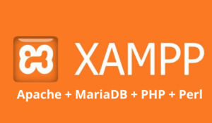

## 🐧 Fedora 40 – jak nainstalovat XAMPP




Pokud vyvíjíte v [PHP](https://www.php.net/) neobejdete se bez nástrojů které Vám zapnou lokální podporu phpmyadmin a apache server na Vašem stroji. Jedním z nástrojů je [XAMPP](https://www.apachefriends.org/index.html).

V tomto tutoriálu vám ukážeme, jak nainstalovat XAMPP na Fedora 40.  XAMPP je open-source řešení pro webový server, který zahrnuje Apache, MySQL, PHP a Perl. Poskytuje pohodlný způsob, jak nastavit místní vývojové prostředí na různých operačních systémech, včetně Linuxu, macOS a Windows. Pomocí XAMPP mohou vývojáři snadno testovat a nasazovat webové aplikace bez potřeby živého serveru. Přibalené komponenty bezproblémově spolupracují, což usnadňuje místní vývoj a ladění webových aplikací před jejich nasazením do produkčního prostředí.

1. Aktualizuje systém a  nainstalujeme potřebný balíček libnslže zadáme do terminálu tento příkaz:
```
sudo dnf -y update && sudo dnf -y install libnsl
```
2. Pokud nemáte nainstalujte si wget pro stažení balíčků:
```
sudo dnf -y install wget
```
3. Stáhneme balíček s XAMPP:
```
wget https://sourceforge.net/projects/xampp/files/XAMPP%20Linux/8.2.12/xampp-linux-x64-8.2.12-0-installer.run
```
4. Rozbalíme balíček:
```
chmod a+x xampp-linux-x64-*-installer.run
```
5. Spustíme instalaci:
```
sudo ./xampp-linux-x64-*-installer.run
```
6. Zaškrtneme XAMPP Developer Files a XAMPP Core Files. Potvrdíme instalaci a počkáme než proběhne.

7. Naistalujeme balíček libxcrypt-compat :
```
sudo dnf install -y libxcrypt-compat
```
8. Nastartujeme LAMP:
```
sudo /opt/lampp/lampp start
```
9. Otestujeme funkčnost tímto odkazem http://localhost/ a měla by se nám zobrazit XAMPP web page.

10. Ještě otestujeme phpadmin tímto odkazem http://localhost/phpmyadmin

11. Běžící LAMP zastavíme tímto příkazem:
```
sudo /opt/lampp/lampp stop
```
12. A pokud budeme chtít XAMPP odinstalovat provedeme to takto:
```
cd /opt/lampp
sudo ./uninstall
sudo rm-rf /opt/lampp
```