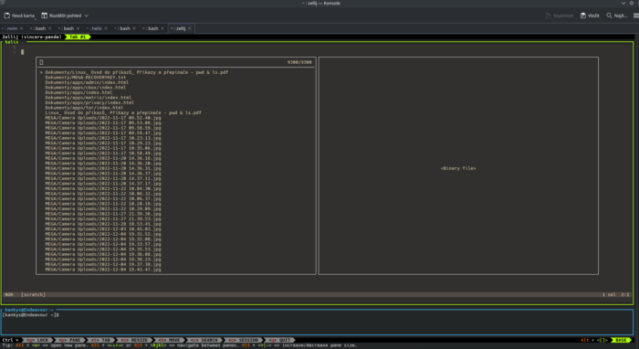

# Ještě lepší Helix s Zellij terminálovým multiplexorem


Co mi chybí na Helix, je způsob, jak z něj zavolat terminál a otevřít terminál stejnou cestou, na kterém pracuji.

Abych toho dosáhl, používám [Zellij](https://zellij.dev/) , což je terminálový multiplexor.

## Konfigurace Zellij

Zellij vám umožňuje vytvářet vlastní rozvržení, která lze vyvolat při spuštění, abyste je lépe přizpůsobili práci, kterou budete dělat.

Následuje konfigurace dolu pro práci s textovým editorem Helix. Tuto konfiguraci jsem uložil pod touto cestou ~/.config/zellij/layouts/helix.kdl:
```
layout {
    pane size=1 borderless=true {
        plugin location="zellij:tab-bar"
    }
    pane {
        command "helix"
        args "."
    }
    pane split_direction="vertical" size="10%" {

    } 
    pane size=2 borderless=true {
        plugin location="zellij:status-bar"
    }
}
```
Výsledkem je následující rozložení:



Helix běžící v horním podokně s terminálovou konzolí v jiném podokně dole, ve stejné cestě jako projekt, se kterým pracuji!! a přesně tohoto cíle jsem chtěl dosáhnout.

## Konfigurace systému

Nyní ke spuštění zellij s vlastním rozložením a instancí Helix musíte spustit:
```
zellij --layout ~/.config/zellij/layouts/helix.kdl
```
Z míste v terminálu kde chcete spustit Helix.

Nyní pro zjednodušení tohoto příkazu jsem vytvořil alias zhxa uložil to do mého ~/.bashrcsoubor.
```
alias zhx='zellij --layout $HOME/.config/zellij/layouts/helix.kdl'
```
S touto konfigurací pokaždé, když potřebuji vytvořit novou instanci Helixu, stačí zadat zhx do adresáře, se kterým chci pracovat, a [Zellij](https://zellij.dev/) mi zavolá [Helix](https://helix-editor.com/) a automaticky otevře projekt.
