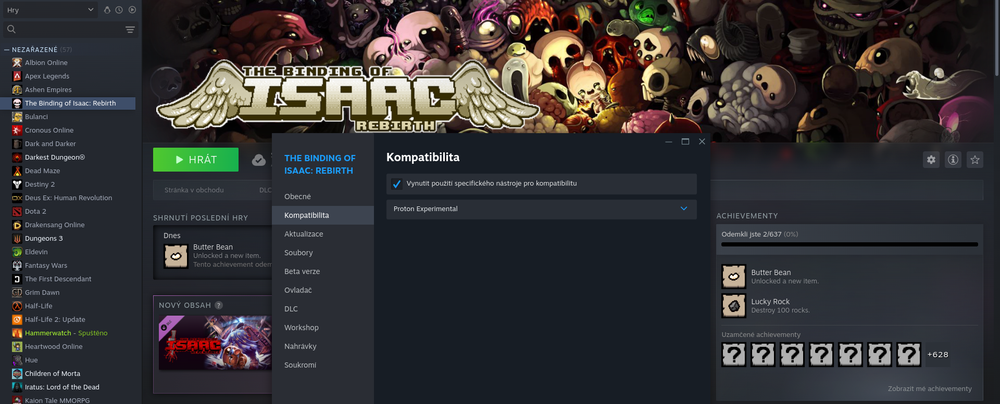

# 🕹 Jak opravit na Steamu, když se nám v Linuxu nechce spustit hra pro Linux

Někdy se může stát, že námi zakoupená hra na [Steamu](https://store.steampowered.com/) nefunguje v Linuxu i když je u ní uvedeno že je pro Linux.

Jedna z možností je zkusit **Vynutit použití specifického nástroje kompatibilitu**

1. Vyberte hru na Steamu, kterou chcete spustit
2. Klikněte na tlačítko **Vlastnosti**
3. Zobrazí se okno  **S nastavením hry**
4. Klikněte na tlačítko **Kompatibilita**
5. Tam zaškrtneme **Vynutit použití specifického nástroje kompatibilitu**
6. A vybereme  **Proton experimental**

### Pokud toto nepomůže, zkuste ještě:
1. Ve vlastnostech hry klikněte na **Obecné**
2. Od škrtněte **Povolit ve hře překrytí služby Steam**

Pokud nic s tohoto nepomohlo stále máte [právo na vrácení peněz](https://help.steampowered.com/en/faqs/view/784C-923B-A4A1-C825) za hru od Steamu.