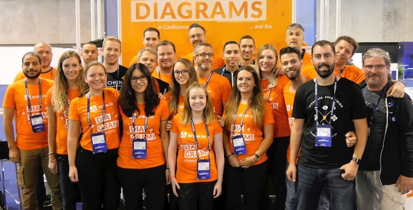

# OpenSource aplikace Diagrams, skvělé diagramy zcela zdarma

[diagrams.net](https://app.diagrams.net/) (dříve **draw.io**) je bezplatný a open source multiplatformní software pro kreslení grafů vyvinutý v HTML5 a JavaScriptu.  Jeho rozhraní lze použít k vytváření diagramů, jako jsou vývojové diagramy, drátové modely, diagramy UML, organizační diagramy a síťové diagramy. 

diagrams.net je k dispozici online jako webová aplikace pro více prohlížečů a jako offline desktopová aplikace pro Linux, macOS a Windows. Jeho offline aplikace je vytvořena pomocí elektronového rámce. Webová aplikace nevyžaduje online přihlášení ani registraci a může se otevřít a uložit na místní pevný disk.  Mezi podporované formáty pro ukládání a export ke stažení patří PNG, JPEG, SVG a PDF. 

Integruje se také s cloudovými službami pro ukládání, včetně Dropboxu, OneDrive, Disku Google, GitHubu a GitLab.com. 

Je také k dispozici jako plugin pro vložení webové aplikace do platforem, jako jsou NextCloud, MediaWiki, Notion, Atlassian Confluence a Jira.

Může být jako alternativa k Lucidchart, Microsoft Visio a SmartDraw.

 

**A co o sobě píší tvůrci Diagrams?**

## O diagrams.net



diagrams.net/draw.io je open source technologický stack pro vytváření aplikací pro vytváření diagramů a světově nejpoužívanější software pro vytváření diagramů koncových uživatelů založený na prohlížeči.

diagrams.net je ochranná známka a draw.io je registrovaná ochranná známka společnosti JGraph Ltd. JGraph Ltd je společnost registrovaná v Anglii, která vyvíjí a vlastní software, provozuje diagrams.net a draw.io stránky a vlastní diagrams.net a draw.io značky.

Slibujeme vám, že před vámi nebudeme skrývat vaše data a vždy vám poskytneme nějaký způsob, jak tato data otevřít a upravit, a to zdarma. Když nám společnosti vyplácejí peníze, mělo by to být proto, že přidáváme hodnotu, ne proto, že jsou uzamčeni.

Narušujeme průmysl novým obchodním modelem, který dosahuje přiměřených zisků, aby zaplatil specializovaný, profesionální softwarový tým, ale nepoužívá umělý nedostatek k vytvoření nafouklé společnosti zaměřené na prodej s odpovídajícími příjmy.

Naším posláním je **„poskytovat bezplatný, vysoce kvalitní software pro vytváření diagramů pro každého“**.

Proč?

* Diagramový software má hodnotu $ 1B + ročně, ale v této oblasti se neděje nic, co by ospravedlňovalo tento objem prodeje. Diagramming je webová aplikace pro produktivitu zásob, jako je zpracování textu a tabulky.
* Aplikace SaaS mají problém s důvěryhodností. V současné době dodavatelé poskytují aplikaci i ukládají vaše data a poté vám měsíčně účtují poplatky za přístup k nim. Snaží se zajistit, aby náklady na odchod byly vyšší než náklady na obnovu (ne v dobrém slova smyslu).
* Stejně jako u většiny proprietárního softwaru jsou příjmy generovány umělým nedostatkem, ctižádostivým prodejem a de facto formáty souborů, které nutí společnosti kupovat produkt, pro který je tento formát nativní.

Jak?

* Náš model je založen na virálním efektu bezplatné aplikace s otevřeným zdrojovým kódem. Když sdílíte diagram diagrams.net, víte, že ho může otevřít a upravit kdokoli.
*Tím, že vám umožní stavět na softwaru zdarma, nejen jej používat. Nahrazení proprietárního softwaru jednou aplikací s otevřeným zdrojovým kódem také není užitečné. Můžete vzít stávající diagrams.net základnu a stavět pro konkrétní vertikální trhy, přidávat a vylepšovat funkce. Konkurence je dobrá.
* Výběrem jednoho komerčního ekosystému, který bude účtovat za aplikaci, kde je hostitelský produkt placen a ziskové marže největší, a to byl ekosystém Atlassian. Všimněte si, že stále řídíte přístup ke svým datům na Confluence a Jira, neuchylujeme se k uzamčení vašich dat jen proto, že se jedná o komerční platformu.
```
JGraph Ltd
Artisans' House,
7 Queensbridge
NN4 7BF
Northampton
UK
JGraph Ltd is a private limited company registered in England #04051179
```


Na závěr dodám aplikace je celá v češtině.
