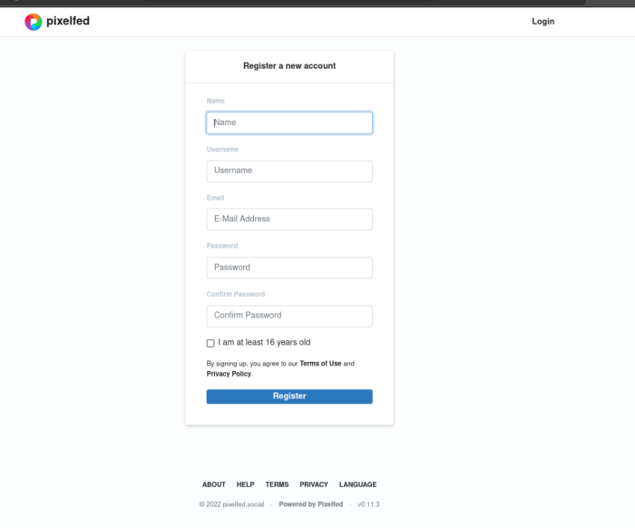

# Pixelfed decentralizovaný Instagram

Alternativní platformy pro sdílení fotografií jsou na vzestupu a jejich cílem je být lepší než Instagram.  A jednou z těch alternativ, je Pixelfed.

## Pixelfed: decentralizovaná alternativa Instagramu

Pixelfed, je „decentralizovaná alternativa k centralizovaným platformám“, byl vytvořen pro otevřený web. Instagram je naproti tomu příkladem centralizované platformy, kterou zcela ovládá společnost Meta. Pixelfed místo toho běží na open-source kódu, který může získat a používat kdokoli. To znamená, že uživatelé Pixelfed s technickým know-how mohou provozovat svůj vlastní server Pixelfed. Můžete se také jednoduše připojit k serverům, které již byly vytvořeny jinými uživateli Pixelfed.

O otevřeném webu – proč byl vytvořen a jeho výhodách – se toho dá hodně říct, ale důležité je, že  Pixelfed není řízen vyššími společnostmi. Ovládají jej jeho uživatelé, kteří si mohou zdrojový kód opatřit veřejně a dělat si s ním, co uznají za vhodné.

#### Hlavní vlastnosti Pixelfed

* Je zdarma k použití
* Neobsahuje žádné reklamy
* Má chronologický zdroj (žádné algoritmy)
* Zaměřuje se na ochranu soukromí (žádné analýzy nebo sledování třetích stran)
* Nabízí popisy médií pro zrakově postižené
* Poskytuje fotografické filtry pro přidání  obrázků
* Má možnost přiřadit licenci k obrázku
* Umožňuje vybrat publikum: veřejné, neuvedené nebo pouze sledující
* Nemá mobilní aplikaci, ale lze k němu přistupovat pomocí mobilního webového prohlížeče

Nyní, když o této platformě něco málo víte, pojďme se na ni podívat v akci. Za prvé: Jak nahrávat a sdílet obrázky.

### 1. Vytvořit nový příspěvek

Přejděte na https://pixelfed.social a přihlaste se nebo si zaregistrujte účet. Registrace je jednoduchá a zvládne ji každý.

 
### 2. Klikněte na Nový příspěvek

Máte také možnost pro **Nový příběh (New Story)** a **Nová sbírka (New Collection)**. Ty zatím vynecháme.

My využijeme **Nový příspěvek (New Post)**.

Vyberte obrázek, který chcete nahrát z telefonu nebo plochy, a klikněte na **Nahrát (upload)** . Pixelfed podporuje tyto formáty:

* Jpeg
* Gif
* PNG
* Webp

### 3. Použijte fotografický filtr (volitelné)

Klikněte na šedou šipku nad obrázkem.

Vyberte filtr. Potom klepněte na tlačítko **Další (Next)**.

### 4. Napište popisek

Popisky jsou omezeny na 2000 znaků.

### 5. Zaškrtněte Další možnosti

* Označte lidi (maximálně pět profilů na komentář nebo příspěvek).
*   V případě potřeby ji přidejte do sbírky jiných fotografií nebo založte novou sbírku.
* V případě potřeby přidejte licenci. Výchozí nastavení je **All Rights Reserved**
* Pokud chcete, přidejte umístění.
* **Vyberte si publikum**.
    * Veřejné: viditelné pro všechny na veřejné časové ose
    * Neveřejné: viditelné na veřejném profilu, ale na své časové ose jej vidí pouze sledující.
    * Pouze sledující: viditelné pouze pro sledující, včetně vašeho profilu
* Vyberte **Pokročilá nastavení (Advenced settings)*:
    * Vypněte komentování
    * Vytvořte popis média pro zrakově postižené

### 6. Příspěvek (Post)

Klikni na Post. Váš obrázek byl nyní zveřejněn.

#### Povolit nebo zakázat komentáře

Možná budete chtít povolit nebo zakázat komentáře k vašemu příspěvku. Klikněte na **tři malé šedé svislé kroužky**.  Poté klikněte na **Povolit komentáře (Enable Comments)** nebo **Zakázat komentáře (Disable Comments)** .

#### Správa pošty (Post Management)

Sdílejte, archivujte nebo smažte svůj příspěvek kdykoli v budoucnu.

Klikněte na nastavení účtu v pravém horním rohu a z rozbalovací nabídky vyberte **Profil** . Najděte příspěvek a klikněte na něj, klikněte na **tři malá šedá svislá kolečka** a poté na příslušnou možnost:

* Kliknutím na **Sdílet (Share)** můžete příspěvek sdílet se sledujícími, zkopírovat odkaz nebo jej vložit někde jinde získáním kódu pro vložení.
* Kliknutím na **Archivovat (Archive)** zabráníte ostatním v interakci nebo prohlížení. Archivované příspěvky nelze smazat ani s nimi jinak interagovat. Chcete-li zrušit archivaci příspěvku, přejděte do svého profilu a nahoře klikněte na ** Archiv** . Přejděte na příspěvek, jehož archivaci chcete zrušit. Klikněte na tři malé šedé svislé kroužky a klikněte na Zrušit **archivaci a** poté na **OK**.
* Kliknutím na **Smazat (Delete)** příspěvek zcela odstraníte.

Osvoboďte se od Instagramu

Pokud vám etické funkce Instagramu brání ve vytváření obrázků a jejich sdílení s vašimi sledujícími, pak je čas zvážit další možnosti – a skutečně existují. Nejste připoutáni k používání Instagramu, jak by se mohlo zdát. Ano, bude vám chvíli trvat, než si vytvoříte novou komunitu sledujících a přesvědčíte ostatní, aby migrovali na vámi zvolenou alternativní platformu, ale pokud nejste spokojeni s Instagramem, ztrácíte čas. Přestaňte přispívat na platformu, která není v souladu s vašimi přáními a potřebami, a začněte přispívat na platformu, která je decentralizovaná. Nejen, že to pro vás bude lepší, ale také to znamená, že budete podporovat platformu (a její komunitu, i když ne penězi), které skutečně věříte.