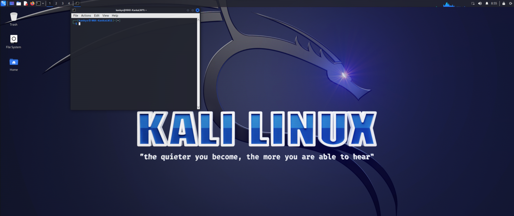
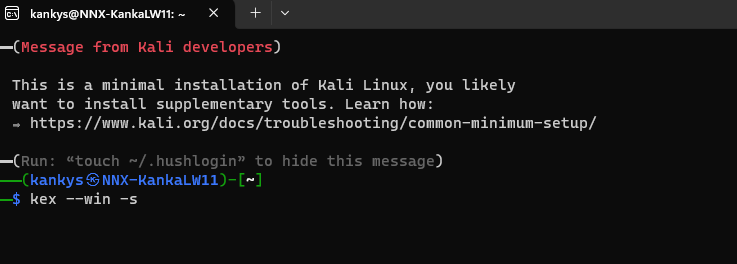
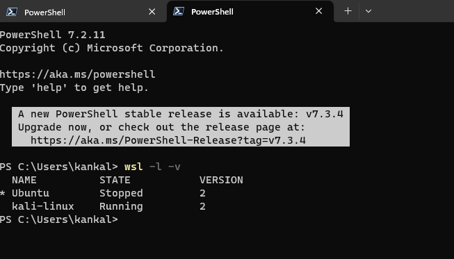

# Kali-Linux ve Windows 11 s vlastním GUI, rychlá instalace



Pokud vám něco říká WSL2 a Subsystém Linux ve vašich Windows 11 nebude pro vás problém si do Windows 11 nainstalovat kali-linux, distribuci založenou na Ubuntu.

Předpokládám, že máte aktivovaný WSL2 ve Windows. Pokud ne napište mi a inviduálně vše nastavíme, je to otázka pár kliknutí ( jak zprovoznit WSL ve Windows bude mít samostatný článek).

A pokud si ho budete hned chtít aktivovat stačí v  jako administrátor spustit PowerShell a zadat tyto tři příkazy:
```
dism.exe /online /enable-feature /featurename:Microsoft-Windows-Subsystem-Linux /all /norestart 
dism.exe /online /enable-feature /featurename:VirtualMachinePlatform /all /norestart 
wsl –set-default-version 2 
```
 
Když už máte aktivovaný WSL2 – Subsystém Linux a VirtualMachine je třeba nainstalovat kali-linux. To můžeme provést z Microsoft Store nebo z PowerShellu.

Pro instalaci kali-linux v PowerShellu použijeme příkaz:
```
wsl –install -d kali-linux
```
Po instalaci spustíme kali-linux jako jakoukoliv jinou aplikaci z nabídky Start.

Po spuštění kali-linux se vám spustí v příkazovém řádku.

Budete požádaní o vaše uživatelské jméno a heslo to zadáte ještě jednou pro kontrolu.

Pak už do konzole postupně zadáte tyto příkazy:

Tento vám aktualizuje kali-linux:
```
sudo apt update 
```

Tento vám naistaluje GUI do kali-linux:
```
sudo apt install -y kali-win-kex 
```
A tímto spustíte grafické rozhraní kali-linux:
```
kex –win -s 
```
Pak se vás dvakrát zeptá na heslo (při dalším zadání tohoto příkazu už se ptát nebude maximálně jen jednou na přihlášení).

Poprvé u posledního příkazu až se bude ptát terminál na heslo a budete tam mít na výběr yes nebo no, tak potvrďte v terminálu no zadáním no! Jinak vám kali-linux půjde bez zvuku.



A to je vše užijte si kali-linux ve svém PC s Windows.

Ještě dva malé tipy, zmáčknutím klávesy F8 v kali-linux otevře se vám nabídka kde například můžete kali-linux z fullscreenu přepnout do okna.

A druhý tip že, vám běží po instalaci kali-linux nebo je nainstalovaný, ale vypnutý zjistíte v PowerShellu tímto příkazem:
```
wsl -l -v
```


 
Autor článku není zodpovědný za to, pokud se něco nepovede, vše děláte na vlastní zodpovědnost!

Pokud tomuto tématu nerozumíte nebo nejste dostatečně technicky schopní, nejdříve si přečtěte k WSL dokumentaci na stránkách Microsoftu. Tím přejdete případným problémům.