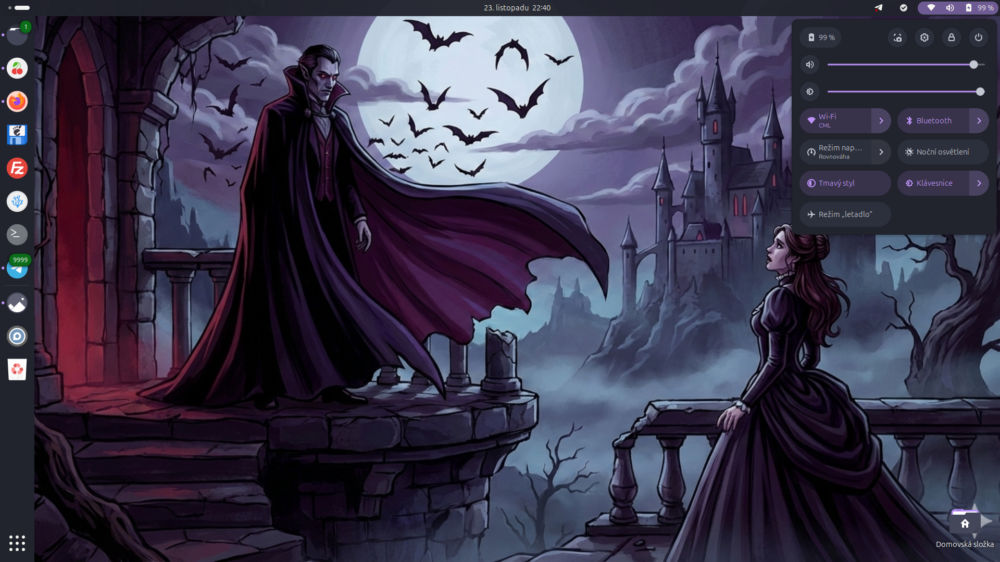
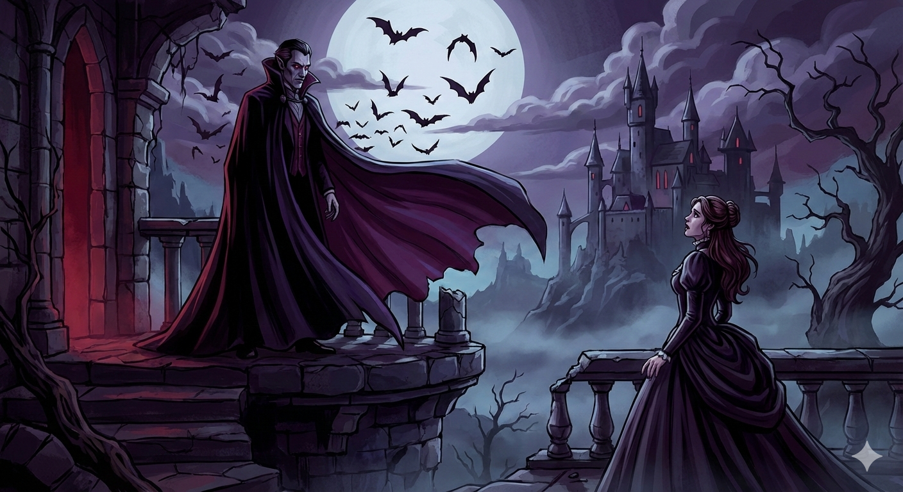

# 🧛 Návod na Dracula Theme pro Ubuntu 24.04.LTS

Zde je kompletní návod na Dracula Theme **„Master Guide“** pro Ubuntu 24.04.

Tento návod změní: Okna, Ikony, Terminál, Horní lištu (Shell) a zajistí, že i nové aplikace (Nastavení, Soubory) budou vypadat správně.



Otevři terminál (Ctrl+Alt+T) a jdeme na to krok za krokem.

### Krok 1: Příprava systému a nástrojů

Nainstalujeme vše potřebné: git (stahování), gnome-tweaks (nastavení vzhledu) a gnome-shell-extension-manager (pro obarvení horní lišty).

```
sudo apt update
sudo apt install git gnome-tweaks gnome-shell-extension-manager -y
```
Dále si připravíme složky, kam budeme stahovat:

```
mkdir -p ~/.themes ~/.icons ~/.config/gtk-4.0
```

### Krok 2: Stažení Dracula Motivu (Okna a Shell)

Stáhneme hlavní motiv, který se postará o vzhled oken aplikací i horní systémové lišty.

```
git clone https://github.com/dracula/gtk.git ~/.themes/Dracula
```

### Krok 3: Stažení Dracula Ikon

#### Tela Circle (Varianta Dracula) – Moderní a kulaté

Toto jsou v současnosti jedny z nejpopulárnějších ikon pro Linux. Jsou velmi kvalitní a mají specifickou fialovou „Dracula“ variantu.

Otevřete terminál a stáhněte repozitář:

```
git clone https://github.com/vinceliuice/Tela-circle-icon-theme.git
```

Jděte do složky a nainstalujte pouze Dracula variantu:

```
cd Tela-circle-icon-theme
./install.sh dracula
```

Úklid (smazání instalačních souborů):

```
cd ..
rm -rf Tela-circle-icon-theme
```

### Krok 4: Oprava pro Ubuntu 24.04 (Libadwaita) – DŮLEŽITÉ

V Ubuntu 24.04 aplikace jako Soubory (Nautilus) nebo Nastavení ignorují běžná témata. Musíme vytvořit „propojku“ (symbolický odkaz), aby systém věděl, že má Draculu použít i tam.

Zkopíruj a vlož celý tento blok příkazů:

```
ln -sf ~/.themes/Dracula/gtk-4.0/gtk.css ~/.config/gtk-4.0/gtk.css
ln -sf ~/.themes/Dracula/gtk-4.0/gtk-dark.css ~/.config/gtk-4.0/gtk-dark.css
ln -sf ~/.themes/Dracula/assets ~/.config/gtk-4.0/assets
```

### Krok 5: Instalace Dracula Terminálu

Aby byl i příkazový řádek fialový. Pozor tady pozorně čtěte co se vás terminál ptá na otázku YES continue odpovězte YES.

```
git clone https://github.com/dracula/gnome-terminal
cd gnome-terminal
./install.sh
# Vše potvrďte. Až to doběhne, vrátíme se zpět a uklidíme:
cd ..
rm -rf gnome-terminal
```

### Krok 6: Povolení změny horní lišty (User Themes)

Abychom mohli obarvit horní panel (kde jsou hodiny a wifi), potřebujeme rozšíření.

Otevři aplikaci Správce rozšíření (Extension Manager) – je to ta modrá ikona puzzle, co jsme instalovali v kroku 1.    

V aplikaci klikni nahoře na Procházet (Browse).

Hledej „User Themes“.

Klikni na Nainstalovat (Install).

### Krok 7: FINÁLE – Aktivace všeho

Teď to všechno zapneme.

Otevři aplikaci Vyladění (Gnome Tweaks).

Jdi do sekce Vzhled (Appearance).

Nastav to přesně takto:

Starší aplikace (Legacy Apps): **Dracula**

Ikony (Icons): **Tela-circle-dracula**

Prostředí (Shell): **Dracula** (Pokud je u Shell vykřičník, zavři Vyladění a znovu ho otevři, už by to mělo jít).

Terminál: Otevři Terminál -> Klikni na menu (tři čárky vpravo) -> Předvolby -> Profily -> Vyber Dracula a nastav ho jako Výchozí. Apokud tam profil Dracula nebude klikni na + a vytvoř profil Dracula.

**Bonus: Tapeta**

Aby to bylo dokonalé, můžeš si stáhnout mou originální tapetu zde v repozitáři.

Klikni na něj pravým tlačítkem -> Nastavit jako pozadí.

**Hotovo!** Nyní máš Ubuntu kompletně v Dracula stylu – od ikon, přes okna, terminál až po systémové lišty.

P.S. já ještě musel restartovat noteebok aby se všechny změny projevily.

Otevři terminál a napiš : reboot

K úplné dokonalosti nezapoměň spousta programů, editoru, IDE a podobně nabízí možnost přepnutí do Dracula Tmeme.


